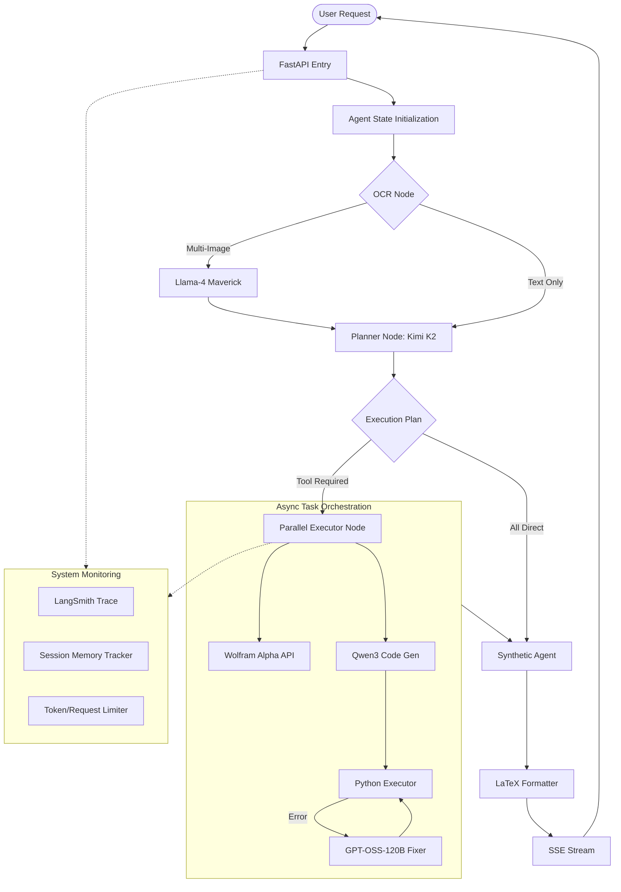

Check out the configuration reference at https://huggingface.co/docs/hub/spaces-config-reference

# Pochi 4.o: Multi-Agent Calculus Orchestration System

Pochi is a high-performance, asynchronous AI platform specialized in solving complex calculus problems. It utilizes a stateful multi-agent system built on LangGraph, coordinating multiple specialized LLMs and symbolic computation engines to achieve pedagogical excellence and mathematical precision.

## Highlight Features

- **Multi-Agent Orchestration**: Stateful DAG-based workflow using LangGraph for complex, multi-stage reasoning.
- **Parallel Sub-problem Processing**: Intelligent decomposition of complex queries into independent atomic tasks executed in parallel.
- **Multimodal OCR Intelligence**: High-fidelity vision extraction from up to 5 concurrent images with specialized math support.
- **Hybrid Solving Engine**: Seamlessly combines symbolic precision (Wolfram Alpha) with algorithmic logic (Python Executor).
- **Intelligent Long-Term Memory**: Massive 256K token context window with proactive memory management and token tracking.
- **Premium UI/UX**: Modern glassmorphism design with reactive animations, interactive tours, and native LaTeX rendering.

## System Architecture and Pipeline

The system is engineered as a directed acyclic graph (DAG) of specialized nodes, managed by a central orchestrator that maintains a consistent state throughout the conversation turn.

### The Execution Pipeline

1.  **Vision Ingestion (OCR Agent)**: Processes up to 5 concurrent image inputs. Utilizing Llama-4 Maverick, it extracts raw text and LaTeX-formatted mathematical expressions.
2.  **Strategic Decomposition (Planner)**: Analyzes user intent and OCR data to generate a vectorized execution plan. It decomposes composite problems into independent atomic tasks (JSON defined).
3.  **Parallel Orchestration (Executor)**: The core processing engine that spawns asynchronous execution threads for each atomic task:
    - **Symbolic Branch**: Direct interface with Wolfram Alpha API for verified algebraic and calculus manipulation.
    - **Algorithmic Branch**: Python Code Engine (Qwen3-32B) for numerical methods or complex multi-step logic.
    - **Heuristic Branch**: Direct LLM solving for theoretical or conceptual queries.
4.  **Self-Correction Loop (Code Engine)**: If the Algorithmic Branch encounters execution errors, a specialized CodeFixer (GPT-OSS-120B) performs recursive debugging and code modification.
5.  **Contextual Synthesis (Synthetic Agent)**: Aggregates atomic results, resolves inter-task dependencies, and consults conversation history to produce a structured, pedagogical response.

### Technical Workflow Diagram



## Fault Tolerance and Error Handling

Pochi is built with a "Resilience-First" mindset, ensuring that the system remains operational and provides accurate results even when facing API failures or ambiguous inputs.

### 1. Model Redundancy and Failover
- **OCR Failover**: If the primary vision model (Maverick) encounters rate limits or internal errors, the system automatically redirects requests to a high-speed fallback model (Scout).
- **Model Switching**: The `ModelManager` dynamically monitors model health and rate limits (RPM/TPM), performing seamless transitions between tiers without task interruption.

### 2. "Self-Healing" Algorithmic Solving
- **Recursive Debugging**: The Python Code Engine is not a simple "one-shot" executor. If generated code fails (SyntaxError, ZeroDivision, etc.), the system sends the error log back to the `CodeFixer` agent.
- **Fix Loop**: The system allows for multiple recursive fix attempts, where the agent analyzes the stack trace and re-writes the logic until a successful execution is achieved.

### 3. Graceful Degradation of Tools
- **Wolfram-to-Code Fallback**: Symbolic math is the gold standard for precision. However, if the Wolfram Alpha API exceeds its 2000-req/month quota or times out, the system automatically shifts the problem to the Algorithmic Branch for a numerical solve.
- **Synthesis Resilience**: If the Synthetic Agent fails to format the final response (e.g., due to context length), the system performs a "raw-safe" synthesis, delivering the tool results directly to the user to ensure no data is lost.

### 4. Robust State and Parsing
- **Durable IO**: The background agent task saves intermediate results to the database immediately upon generation. This ensures that even if a client disconnects during a 20-second calculation, the result is waiting for them upon refresh.
- **JSON Recovery**: LLMs occasionally return malformed JSON. The `Planner` includes a multi-stage recovery logic that uses regex and string normalization to repair broken JSON blocks, preventing system crashes on minor formatting errors.

### 5. Memory and Resource Safety
- **Context Protection**: The `SessionMemoryTracker` proactively blocks requests that would exceed the 256K token limit, preventing "half-baked" or truncated responses from the LLM.
- **Rate Limit Resilience**: Integrated backoff and retry mechanisms for all third-party API calls (Groq, Wolfram, LangSmith).

## Model Distribution and Specialization

| Component | Model Identifier | Specialization |
| :--- | :--- | :--- |
| **OCR (Primary)** | Llama-4 Maverick | Multi-modal mathematical extraction. |
| **OCR (Fallback)** | Llama-4 Scout | High-speed redundancy for simple OCR. |
| **Planner & Synthesis** | Kimi K2-Instruct | 256K Context, complex reasoning, and pedagogy. |
| **Code Generation** | Qwen3-32B-Instruct | Optimized for Pythonic mathematical logic. |
| **Code Rectification** | GPT-OSS-120B | Deep-context code debugging and error resolution. |
| **Symbolic Logic** | Wolfram Alpha | Deterministic symbolic computation (2000 req/mo). |

## Project Structure

```text
.
├── backend/                # FastAPI Application & LangGraph Agents
│   ├── agent/              # Multi-agent logic (Nodes, Graph, State)
│   ├── database/           # SQLite models and migrations
│   ├── tools/              # Symbolic & Algorithmic executor tools
│   └── utils/              # Memory tracking, rate limiting, tracing
├── frontend/               # React (Vite) Application
│   ├── src/
│   │   ├── components/     # UI components (Math rendering, Tour)
│   │   └── App.jsx         # Main application logic
├── Dockerfile              # Containerized deployment
├── pyproject.toml          # Python dependencies & metadata
└── README.md               # Technical documentation
```

## Mathematics & Computation Stack

Pochi utilizes a heavy-duty scientific stack for high-precision calculations:
- **Symbolic**: SymPy, Wolfram Alpha API
- **Numerical**: NumPy, SciPy, Mpmath
- **Optimization**: CVXpy, PuLP
- **Visuals**: Matplotlib, Seaborn, Plotly
- **Data**: Pandas, Polars, Statsmodels

## Local Deployment

### Environment Configuration
Create a `.env` file in the root directory:
```env
GROQ_API_KEY=your_key_here
WOLFRAM_ALPHA_APP_ID=your_id_here
LANGSMITH_API_KEY=your_key_here (optional for tracking)
LANGSMITH_PROJECT=calculus-chatbot
LANGSMITH_TRACING=true
```

### Backend Infrastructure
1.  Initialize virtual environment: `uv venv && source .venv/bin/activate`
2.  Install dependencies: `uv pip install -r requirements.txt`
3.  Launch Service: `python main.py`

### Frontend Application
1.  Navigate to workspace: `cd frontend`
2.  Install packages: `npm install`
3.  Development server: `npm run dev`

### Docker Deployment
Build and run the entire stack:
```bash
docker build -t pochi-app .
docker run -p 7860:7860 -v ./data:/data --env-file .env pochi-app
```

## API Documentation

The backend service automatically generates interactive API documentation.
-   **Swagger UI**: `http://localhost:7860/docs`
-   **ReDoc**: `http://localhost:7860/redoc`

## Advanced Customization

### Prompt Engineering
The system's persona and logic are defined in `backend/agent/prompts.py`:
-   **GUARD_PROMPT**: Defines the "Pochi" persona and strict safety guardrails.
-   **TOT_PROMPT**: Enforces the Tree-of-Thought reasoning process (Plan -> Solve -> Verify).
-   **PLANNER_SYSTEM_PROMPT**: Controls the multi-modal decomposition logic.

Developers can modify these constants to adjust the chatbot's tone or reasoning strictness.

## Security & Privacy Guidelines

- **Session Isolation**: User sessions are logically isolated in the database (`conversations` table) and memory cache.
- **Transient Data**: Uploaded images are processed in-memory (or temp storage) and converted to base64/embeddings; they are not permanently retained on disk for privacy.

## Known Limitations

- **Multimodal Cap**: Supports a maximum of 5 distinct images per query to manage context window limits.
- **Symbolic Rate Limit**: Wolfram Alpha requests are capped at 2000/month. Heavy usage will degrade to the numerical Python solver (Qwen3).
- **Latency**: Complex multi-step reasoning (Plan -> Code -> Fix -> Synthesize) may take 15-30s to fully resolve.

### AI Model Rate Limits

The system enforces strict rate limits to ensure stability and usage fairness:

| Model ID | RPM (Req/Min) | RPD (Req/Day) | TPM (Tokens/Min) | TPD (Tokens/Day) |
| :--- | :---: | :---: | :---: | :---: |
| **Kimi K2 Instruct** | 60 | 1,000 | 10,000 | 300,000 |
| **Llama-4 Maverick** | 30 | 1,000 | 6,000 | 500,000 |
| **Llama-4 Scout** | 30 | 1,000 | 30,000 | 500,000 |
| **Qwen3-32B** | 60 | 1,000 | 6,000 | 500,000 |
| **GPT-OSS-120B** | 30 | 1,000 | 8,000 | 200,000 |

## API Usage Examples

### Natural Language Calculus
> "Tính đạo hàm của f(x) = x^2 + 3x + 2"

### Multimodal Math Analysis (Image Support)
> [Upload 2 images of a calculus problem] "Giải bài toán trong ảnh sau"

### Algorithmic Mathematical Tasks
> "Sử dụng mã Python để tìm 100 số nguyên tố đầu tiên và giải thích thuật toán Sieve of Eratosthenes."

## Troubleshooting

| Issue | Possible Cause | Solution |
| :--- | :--- | :--- |
| **413 Payload Too Large** | Uploading images > 10MB total. | Reduce image size or upload fewer files per turn. |
| **429 Too Many Requests** | Exceeded Wolfram or LLM rate limits. | Wait 60s or switch to a different model tier in `.env`. |
| **LangSmith Error** | Invalid or missing API Key. | Set `LANGSMITH_TRACING=false` in `.env` to disable. |
| **Docker Build Fail** | Network timeout on `uv sync`. | Check internet connection or increase Docker memory limit. |

## Contributing

We welcome contributions! Please follow these steps:
1.  Fork the repository.
2.  Create a feature branch: `git checkout -b feature/amazing-feature`.
3.  Commit your changes: `git commit -m 'Add amazing feature'`.
4.  Push to the branch: `git push origin feature/amazing-feature`.
5.  Open a Pull Request.

## License

Distributed under the MIT License. See `LICENSE` for more information.

## Acknowledgments

We deeply appreciate the open-source community and the providers of the powerful technologies that make Pochi possible:

- **AI & Logic Providers**:
    - **LangChain & LangGraph**: For the robust orchestration framework.
    - **Groq**: For ultra-low latency Llama inference.
    - **Alibaba**: For the Qwen model.
    - **OpenAI**: For the GPT-oss model.
    - **Moonshot AI**: For the Kimi reasoning model.
    - **Meta AI**: For the Llama vision models.
    - **Wolfram Alpha**: For the symbolic computation engine.
- **Frontend Ecosystem**:
    - **React & Vite**: For the blazing fast UI.
    - **Lucide React**: For the beautiful icon set.
